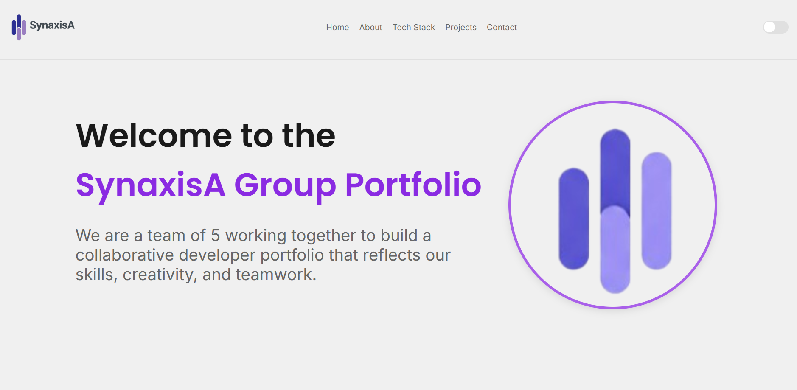

# SynaxisA - Group Portfolio

## Overview
Welcome to **SynaxisA**, a collaborative portfolio project built by a team of five passionate and skilled developers. This project serves as a showcase of our combined abilities in web development, demonstrating our commitment to teamwork, creativity, and technical excellence.

---

## Live Demo & Screenshots
Check out our live site to see our work in action. The portfolio is fully responsive and features a dark/light mode toggle.

**Live Link:** [https://synaxisa.netlify.app/](https://synaxisa.netlify.app/)

### Screenshots




---

## Project Features
Our portfolio includes the following key pages, each with a unique design and purpose:
* **Home:** A welcoming landing page that introduces the project and our team.
* **About:** An in-depth look at each team member, highlighting individual skills and contributions.
* **Tech Stack:** A comprehensive overview of the technologies, languages, and frameworks we used to build this project.
* **Projects:** A dedicated section to showcase the projects we've built.
* **Contact:** A functional contact form for visitors to reach out to us.

---

## Design and Technology
This portfolio was built with a focus on a clean, modern design and robust web technologies.

### **Fonts**
We used the **Inter** and **Poppins** font families from Google Fonts to maintain a consistent and readable typography.

### **Styling**
The entire site is styled with plain CSS, including a smooth dark/light mode toggle for a personalized user experience.

### **Key Technologies**
* **HTML5**: For semantic and well-structured page content.
* **CSS3**: For all styling, layout, and responsive design.
* **JavaScript**: To handle interactive elements and the theme-switching functionality.
* **Git & GitHub**: For collaborative version control and project management.

---

## Getting Started
To view this project locally, follow these simple steps:

1.  **Clone the repository:**
    ```bash
    git clone [https://github.com/rayeberechi/SynaxisA.git](https://github.com/rayeberechi/SynaxisA.git)
    ```
2.  **Navigate to the project directory:**
    ```bash
    cd SynaxisA
    ```
3.  **Open the files:**
    Open the `index.html` file in your preferred web browser to view the project.

---

## Team
* **Faith** - Home & Tech Stack
* **Ayima** - About
* **Dominion** - Projects
* **Abayomi** - Contact
* **Charity** - Home

---

## Credits
Built with ❤️ by the **SynaxisA Team** during our Software Engineering journey at PORA Academy.